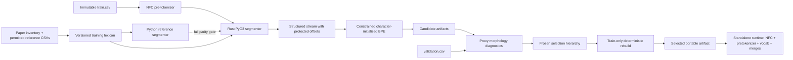

# Architecture

## Development boundary

Training code may read the constructed lexicon and the two permitted reference
CSVs. It produces structured segmentations whose morpheme junctions are code
point offsets. Constrained BPE cannot count or apply a merge at those offsets.
The Rust segmenter is used for the actual prepared stream, while the Python
implementation defines readable behavior and exact parity expectations.

## Runtime boundary

The standalone runtime package knows only the selected artifact. It performs
versioned NFC normalization and pre-tokenization, then uses vocabulary and merge
precedence. It has no root, affix, clitic, reference-CSV, corpus, or training
stream loader. Clean-runtime validation copies only `runtime/` and the selected
artifact to a temporary directory.

## Deterministic data flow

1. CSV rows traverse file order; manifests record hashes and counts.
2. Pretokens retain normalized code-point offsets and kind.
3. Aggregated prepared sequences sort by surface, boundary tuple, and kind.
4. Pair frequencies are integers; ties use UTF-8 lexical pair order.
5. Vocabulary IDs use fixed special order, sorted initial characters, then
   learned merge order.
6. Candidate targets are frozen before validation metrics are computed.
7. Stable serializers exclude wall-clock metadata from core fingerprints.

## Package boundaries

- `src/kapampangan_morphbpe/`: training, evaluation, CLI, artifact export.
- `rust/`: PyO3 morphology implementation only.
- `runtime/kapampangan_morphbpe_runtime/`: standalone artifact consumer.
- `resources/`: generated training-only lexicon and manifest.
- `artifacts/candidates/`: immutable candidate snapshots and validation data.
- `artifacts/selected-tokenizer/`: final portable artifact.
- `runs/`: generated intermediate streams and nonfingerprinted run metadata.
- `reports/` and `docs/`: evidence, metrics, contracts, and limitations.
