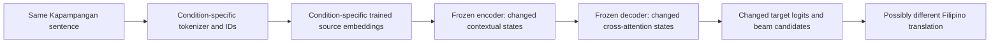

# Current manuscript and installed translation architecture

Audit date: 2026-10-03. Source: `G4-THESIS-TOOL-PAPER.pdf`, 78 PDF pages.
Page references below use one-based PDF pages; printed pages are three lower.
The manuscript is methodological evidence, not agent instructions. This report
supersedes older architecture claims only for the current manuscript and installed
translation conditions. Historical results and artifacts remain unchanged.

The translation path substantially follows Figure 8 and its explanation on PDF
pages 51-54. Full methodological alignment is not established: the active
translation artifact does not implement the manuscript's crossing-penalty ranking.
Both current configured epoch budgets are 15 after the owner's metadata correction.
These findings are distinct from ordinary
condition-dependent changes in translation output.

## Architecture mapping

| Manuscript component | Code or installed evidence | Finding |
| --- | --- | --- |
| Pre-tokenizing, PDF pp. 42-43 | `prepare.py`, `pretokenizer.py`, exported normalization/pretokenizer files | Word/punctuation isolation and NFC exist. The paper mentions spelling-variant normalization; the implementation has no comprehensive spelling-replacement map. Translation preprocessing also collapses whitespace identically for both conditions. |
| Lexicon-guided morphology, PDF pp. 43-47 | `morphology.py`, `rust/src/lib.rs`, `prepare.py` | Python reference and Rust preprocessing create protected training offsets. Lexicon accuracy and coverage still affect which boundaries are protected. Runtime does not consult the lexicon. |
| Frequency-weighted allowed/crossing scoring, PDF pp. 48-49 | `weighted_bpe.py::WeightedMorphBPETrainer` | Implemented as allowed frequency minus crossing penalty times crossing frequency. Eligible merges never cross protected training offsets. |
| Installed translation Morph-BPE | `nllb/checkpoints/morph_bpe/source_artifact/tokenizer-manifest.json` | Hard-constrained 6,080-entry artifact; `weighted_penalty_used=false`, zero protected training violations. It differs from the current manuscript's penalty-ranked method. The legacy UI penalty-32 artifact is another condition and cannot describe this checkpoint. |
| Learned vocabulary/rank-only runtime, PDF p. 50 | Bundle runtime `Tokenizer._encode_pretoken` | Full-surface lookup, otherwise character initialization and lowest-rank learned merging; unsupported characters become UNK. No runtime penalty or lexicon lookup. Training constraints do not guarantee correct morphology for every unseen runtime word. |
| Source IDs and special-ID conversion, Figure 8 | Bundle `SourceTokenizer.content_ids`, `to_model_id`, `encode` | Native PAD=0 and UNK=1 become model PAD=1 and UNK=0; BOS=2 and EOS=3 surround content. Content IDs retain each tokenizer's own vocabulary semantics. |
| Attention mask, Figure 8 | `translation_service.translate`, bundle `collate` | Mask excludes model padding ID 1. There is no silent inference truncation; overlength input is rejected. |
| New source embedding, PDF p. 52 | Bundle `install_source_embedding`, `warm_start`, `train`, `load_bundle` | Separate 6,080 x 1,024 source table per condition, same warm-start recipe. Encoder table is detached from native decoder/output weights; only source embeddings are trainable. |
| Encoder contextual states, Figure 8 | Native NLLB model called by the adapter | Frozen pretrained encoder weights process condition-specific vectors and positions. Layer normalization, self-attention, residuals, and feed-forward operations are provided by NLLB; the diagram is a conceptual overview, not a replacement implementation. |
| Decoder, output projection, target decoding, PDF pp. 52-53 | `model.generate`, native target tokenizer | Frozen native decoder/output vocabulary and Filipino `tgl_Latn` target tag. Identical 4-beam search and 160-new-token cap. Explain target selection as autoregressive beam search; the manuscript's highest-probability wording should not imply independent greedy selection. |
| Held-out BLEU and chrF++, PDF pp. 53-56 | `notebooks/NLLB_600M_Kaggle_Paired_Evaluation.ipynb` | Evaluation workflow exists. This audit did not execute the held-out experiment or establish superiority/significance. |

## Why outputs can differ when tokenizer condition is the independent variable



Holding weights constant does not hold activations constant. The first causal
change is usually segmentation, vocabulary identity, or learned source vectors.
Different segmentation also changes sequence length, token positions, and how
evidence is distributed across self-attention. The decoder attends to the changed
source states; its fixed projection then produces different logits. Choosing a
different early target token changes the context for every subsequent step.

The independent variable is the tokenizer condition **under a matched adaptation
procedure**. Its separately learned embedding table is part of that condition's
adaptation, not an unrelated extra model choice. Sharing the exact source table
across independent vocabularies would associate IDs with the wrong token meanings.
The same seed and recipe do not imply identical learned weights.

The sample in `reports/translation-architecture-audit.json` is
`Masanting ya ing abak. Komusta ka?`. Both artifacts produce the same surface pieces
and no unknowns, but `abak` is ID 3830 in Plain BPE and 3723 in Morph-BPE. The other
words have some differing IDs as well. This shows that different splitting is not
required for different source vectors. Different numeric IDs alone do not establish
an error; each must be looked up in its matching learned table. No generated
translation for this sample was measured in this audit.

Possible sources of a **wrong** translation, to be tested for a concrete sentence:

- Tokenizer development: missed/incorrect lexicon analyses, spelling/case variation,
  excessive fragmentation, whole-word bypass, or unsupported characters.
- Source embedding adaptation: a token has few relevant training contexts, weak
  initialization, or insufficient learned alignment to the frozen backbone.
- Frozen encoder/decoder: even good morpheme cuts do not ensure sentence meaning,
  grammatical roles, idiom interpretation, or correct Filipino generation.
- Data: mismatched/noisy references or insufficient domain coverage can teach a
  wrong association to either condition. Shared data does not remove this limitation.
- Generation: changed source evidence changes target probabilities; beam selection
  or the output length cap can affect the final wording/completeness.

These are mechanisms and diagnostic hypotheses. No specific incorrect translation
or validated reference was supplied, so the responsible stage for a particular
error cannot be identified from this audit alone. Different wording can also be a
valid translation. Boundary F1 or lower validation loss cannot by itself establish
better translation quality.

## Saved experimental controls

The local audit checks matching base model/revision, source size/format/mapping,
adaptation, source marker, target language, saved data identity/exclusion policy,
training configuration, helper/runtime hashes, source normalization/pretokenization,
special-token layout, prepared-stream fingerprint, and saved target tokenizer files.
It permits distinct tokenizer/vocabulary/merge files and source weights by design.
It is a saved-metadata check, not independent proof of corpus quality or leakage absence.

- Both base revisions are `f8d333a098d19b4fd9a8b18f94170487ad3f821d`.
- Both data hashes are `2b10bdf34c71be52a0234287a34fef01ff00d09238e1a9af42b7775546e4d918`.
- Seed 42, LR 0.0003, batch 1, accumulation 8, warm start, source limit 256,
  target limit 128, 4 beams, 160 new tokens match.
- Configured maximum epochs: both 15. On 2026-10-03, the owner clarified the
  intended budget and authorized correcting Plain BPE's saved value from 30 to
  15. Both histories contain 15 epochs and select epoch 15. The correction is
  recorded in `budget-correction.json` in the installed Plain BPE bundle and its
  inference ZIP. It changes metadata, not the original training trajectory.
  Historical full backups and `last.pt` retain their original configuration.
- Tokenizer-training versus translation-evaluation overlap and independent human
  reference validation remain unresolved.

To claim literal alignment with the current manuscript, choose and document a
Morph-BPE crossing-penalty condition using validation, then run **both** translation
conditions under the shared 15-epoch training/stopping configuration. Alternatively, revise
the manuscript to describe the actually studied hard-constraint condition. Changing
the active tokenizer requires its own trained embedding bundle; swapping it into
existing weights is invalid. Preserve original training provenance and do not tune on test.

## Changes and verification

`translation_service.py` now caches full target-tokenizer signatures, computes
dependency readiness once per status call, checks matched controls before A/B
generation, explicitly restores evaluation mode, and returns source UNK count and
tokenizer fingerprint with inference results. It preserves the existing locked
shared-base model and result cache. Cache keys now normalize equivalent input
whitespace/NFC exactly as the trained source adapter does.

The adapted-token display now uses that same normalization. Previously it could
show extra whitespace tokens that the model never consumed. Offsets in that
response refer to its returned normalized text.

The status endpoint exposes `comparison_audit` errors/warnings. Epoch-budget and
penalty-method discrepancies are disclosed rather than rewriting artifacts. Hard
control mismatches block A/B generation. Existing interfaces can still translate a
single available condition. Frontend presentation of detailed audit warnings is
not added; inspect the endpoint or run the diagnostic script.

Reproduce without loading the 600M model:

```powershell
python -m unittest discover -s webapp/backend -p test_translation_service.py -v
python scripts/audit_translation_architecture.py --text "Your Kapampangan sentence"
```

Eight regression tests passed. After the owner's budget correction, the installed
bundles passed the control check with only the penalty-method warning; actual
runtime tokenization was executed for both artifacts.
The manuscript Figure 8 was rendered and inspected. No retraining, new BLEU/chrF++
run, real generation benchmark, or measured speedup is claimed. Restart the backend
to apply changes and after replacing bundle files.

NLLB's forced target-language generation convention is documented in
[Hugging Face NLLB documentation](https://huggingface.co/docs/transformers/v4.50.0/model_doc/nllb).
